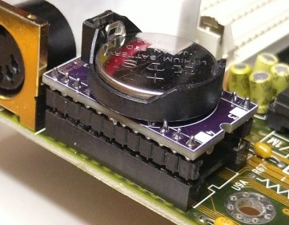
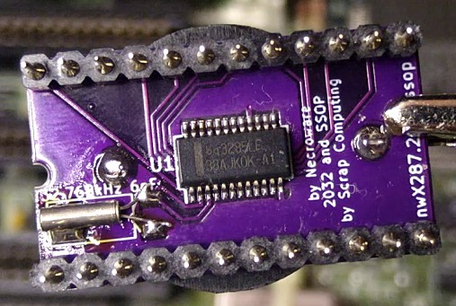
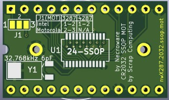

# CR2032 SSOP MOT version of Necroware's nwX287 RTC module

This is a modified version of Necroware's nwX287 RTC module with the following features:
- It uses a common through-hole CR2032 battery holder instead of a CR1225
- It works with an SSOP-24 RTC IC
- It includes a solder-pad for selecting Intel or Motorola bus mode.

For detailed information about the project, please refer to Necroware's original page: https://github.com/necroware/nwX287

## Videos
- Building this module: https://www.youtube.com/watch?v=k7J6g3XWbXA
- Necroware's original video: https://www.youtube.com/watch?v=svPNxILeQEw

## J1 Intel/Motorola mode for BQ3285
BQ3285 Pin 1 is labeled as `MOT` and selects the bus type: Intel or Motorola.
If not set, it defaults to Intel.
BQ4285 uses this pin for providing external power.

The latest `.mot` revision of the board features a solder jumper that connects this Pin 1 of the Timer chip to either pin 1 of the socket or to Vcc.
- For Intel mode or if using BQ4285, short pins 1-2.
- For Motorola mode with the BQ3285, short pins 2-3.

## Bill of Materials

Gerber files are published in the releases: https://github.com/scrapcomputing/nwX287.cr2032.ssop.mot/releases

Part | # | Description
-----|---|-----------------------------------------
U1   | 1 | Real-Time Clock BQ3285S or BQ4285S SSOP-24
Y1   | 1 | Crystal oscillator 32.768kHz 6pF
BT1  | 1 | CR2032 through-hole battery holder

